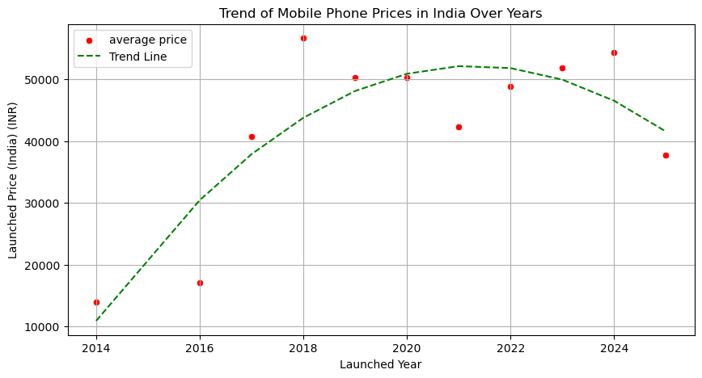
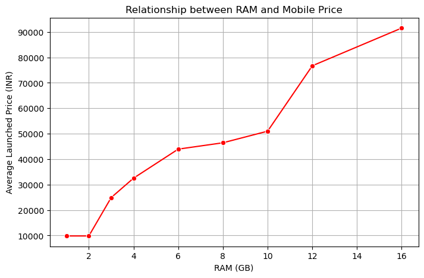
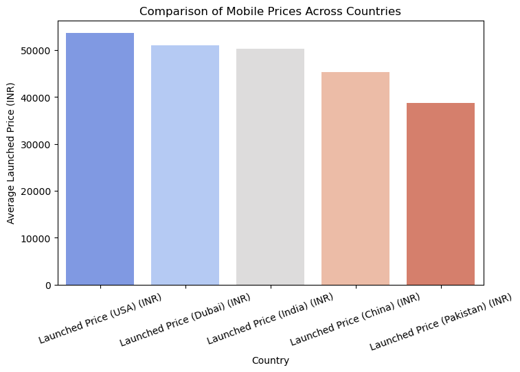
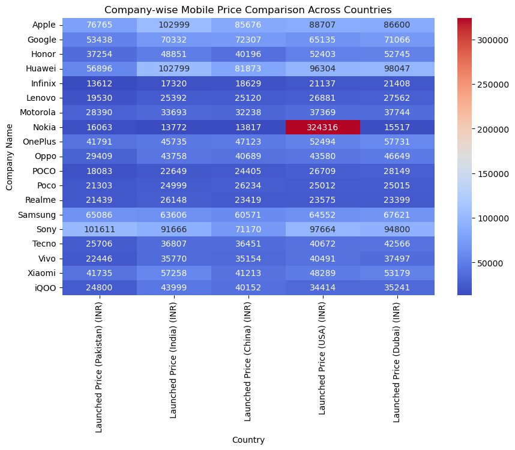
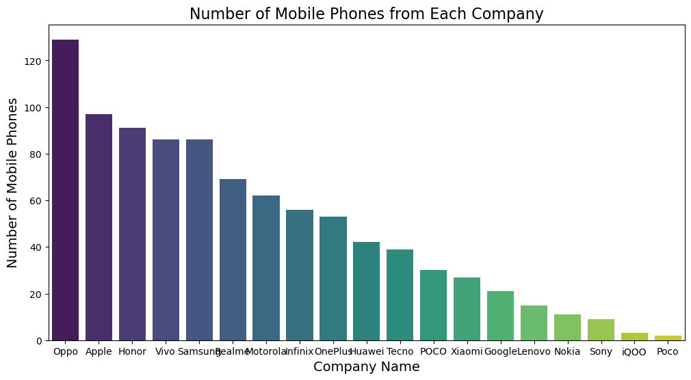
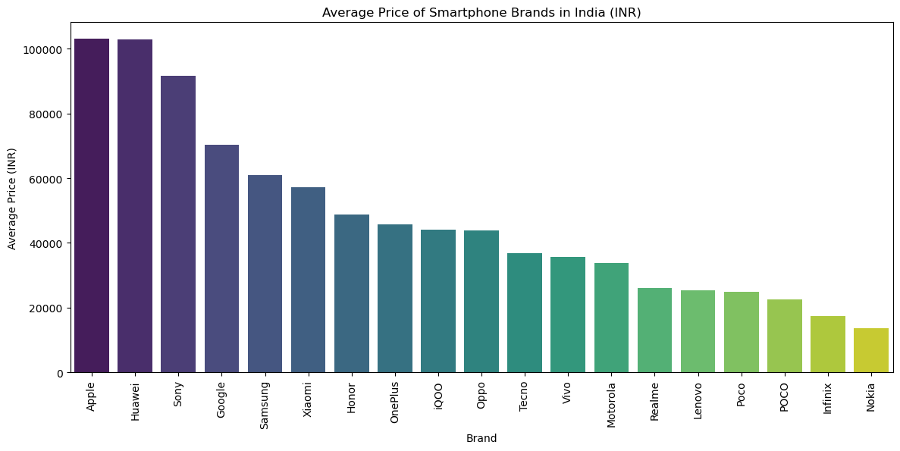

***importing model***


```python
import numpy as np
import pandas as pd
```


```python
import matplotlib.pyplot as plt
import seaborn as sns
from sklearn.metrics import accuracy_score, classification_report, confusion_matrix
```

***Importing dataset***


```python
df=pd.read_csv('c:/Mayook/mobiles_Dataset.csv', encoding='ISO-8859-1')
df.head()
```


<div>
<style scoped>
    .dataframe tbody tr th:only-of-type {
        vertical-align: middle;
    }

    .dataframe tbody tr th {
        vertical-align: top;
    }

    .dataframe thead th {
        text-align: right;
    }
</style>
<table border="1" class="dataframe">
  <thead>
    <tr style="text-align: right;">
      <th></th>
      <th>Company Name</th>
      <th>Model Name</th>
      <th>Mobile Weight</th>
      <th>RAM</th>
      <th>Front Camera</th>
      <th>Back Camera</th>
      <th>Processor</th>
      <th>Battery Capacity</th>
      <th>Screen Size</th>
      <th>Launched Price (Pakistan)</th>
      <th>Launched Price (India)</th>
      <th>Launched Price (China)</th>
      <th>Launched Price (USA)</th>
      <th>Launched Price (Dubai)</th>
      <th>Launched Year</th>
    </tr>
  </thead>
  <tbody>
    <tr>
      <th>0</th>
      <td>Apple</td>
      <td>iPhone 16 128GB</td>
      <td>174g</td>
      <td>6GB</td>
      <td>12MP</td>
      <td>48MP</td>
      <td>A17 Bionic</td>
      <td>3,600mAh</td>
      <td>6.1 inches</td>
      <td>PKR 224,999</td>
      <td>INR 79,999</td>
      <td>CNY 5,799</td>
      <td>USD 799</td>
      <td>AED 2,799</td>
      <td>2024</td>
    </tr>
    <tr>
      <th>1</th>
      <td>Apple</td>
      <td>iPhone 16 256GB</td>
      <td>174g</td>
      <td>6GB</td>
      <td>12MP</td>
      <td>48MP</td>
      <td>A17 Bionic</td>
      <td>3,600mAh</td>
      <td>6.1 inches</td>
      <td>PKR 234,999</td>
      <td>INR 84,999</td>
      <td>CNY 6,099</td>
      <td>USD 849</td>
      <td>AED 2,999</td>
      <td>2024</td>
    </tr>
    <tr>
      <th>2</th>
      <td>Apple</td>
      <td>iPhone 16 512GB</td>
      <td>174g</td>
      <td>6GB</td>
      <td>12MP</td>
      <td>48MP</td>
      <td>A17 Bionic</td>
      <td>3,600mAh</td>
      <td>6.1 inches</td>
      <td>PKR 244,999</td>
      <td>INR 89,999</td>
      <td>CNY 6,499</td>
      <td>USD 899</td>
      <td>AED 3,199</td>
      <td>2024</td>
    </tr>
    <tr>
      <th>3</th>
      <td>Apple</td>
      <td>iPhone 16 Plus 128GB</td>
      <td>203g</td>
      <td>6GB</td>
      <td>12MP</td>
      <td>48MP</td>
      <td>A17 Bionic</td>
      <td>4,200mAh</td>
      <td>6.7 inches</td>
      <td>PKR 249,999</td>
      <td>INR 89,999</td>
      <td>CNY 6,199</td>
      <td>USD 899</td>
      <td>AED 3,199</td>
      <td>2024</td>
    </tr>
    <tr>
      <th>4</th>
      <td>Apple</td>
      <td>iPhone 16 Plus 256GB</td>
      <td>203g</td>
      <td>6GB</td>
      <td>12MP</td>
      <td>48MP</td>
      <td>A17 Bionic</td>
      <td>4,200mAh</td>
      <td>6.7 inches</td>
      <td>PKR 259,999</td>
      <td>INR 94,999</td>
      <td>CNY 6,499</td>
      <td>USD 949</td>
      <td>AED 3,399</td>
      <td>2024</td>
    </tr>
  </tbody>
</table>
</div>


***data studying***


```python
df.info()
```

    <class 'pandas.core.frame.DataFrame'>
    RangeIndex: 930 entries, 0 to 929
    Data columns (total 15 columns):
     #   Column                     Non-Null Count  Dtype 
    ---  ------                     --------------  ----- 
     0   Company Name               930 non-null    object
     1   Model Name                 930 non-null    object
     2   Mobile Weight              930 non-null    object
     3   RAM                        930 non-null    object
     4   Front Camera               930 non-null    object
     5   Back Camera                930 non-null    object
     6   Processor                  930 non-null    object
     7   Battery Capacity           930 non-null    object
     8   Screen Size                930 non-null    object
     9   Launched Price (Pakistan)  930 non-null    object
     10  Launched Price (India)     930 non-null    object
     11  Launched Price (China)     930 non-null    object
     12  Launched Price (USA)       930 non-null    object
     13  Launched Price (Dubai)     930 non-null    object
     14  Launched Year              930 non-null    int64 
    dtypes: int64(1), object(14)
    memory usage: 109.1+ KB
    

***converting Price values into INR***


```python
# Define exchange rates manually (1 rupees in local currency = X INR)
exchange_rates = {
    'PKR': 0.31 ,  # 1 PKR = 0.31 INR
    'CNY': 11.93,    # 1 CNY = 11.93 INR
    'USD': 86.25,     # 1 USD = 86.25 INR
    'AED': 23.51,   # 1 AED = 23.51 INR
    'INR': 1.0, # 1 INR = 1 INR
    
}

columns_to_change = ['Launched Price (Pakistan)', 'Launched Price (India)',
                     'Launched Price (China)', 'Launched Price (USA)', 
                     'Launched Price (Dubai)']

# Convert to USD
for col in columns_to_change:
    df[col] = df[col].astype(str)  # Ensure string type
    df[col + ' (INR)'] = df[col].apply(
        lambda x: exchange_rates.get(x.split()[0], None) * float(x.split()[1].replace(',', '')) 
        if isinstance(x, str) and len(x.split()) == 2 and x.split()[0] in exchange_rates else None
    )
dataset= df.drop(columns=columns_to_change)
```

***Data cleaning***


```python
dataset.dropna(inplace=True)

# Convert columns to string first, then remove units and convert to numbers

dataset['Mobile Weight'] = dataset['Mobile Weight'].astype(str).str.replace('g', '').astype(float)
dataset['RAM'] = dataset['RAM'].astype(str).str.split('/').str[0].str.extract(r'(\d+)').astype(float)
dataset['Front Camera'] = dataset['Front Camera'].astype(str).str.split('/').str[0].str.extract(r'(\d+\.?\d*)').astype(float)
dataset['Back Camera'] = dataset['Back Camera'].astype(str).str.split('+').str[0].str.extract(r'(\d+\.?\d*)').astype(float)
dataset['Battery Capacity'] = dataset['Battery Capacity'].astype(str).str.replace(',', '').str.replace('mAh', '').astype(float)
dataset['Screen Size'] = dataset['Screen Size'].astype(str).str.extract(r'(\d+\.?\d*)')[0].astype(float)
dataset.head(10)
```


<div>
<style scoped>
    .dataframe tbody tr th:only-of-type {
        vertical-align: middle;
    }

    .dataframe tbody tr th {
        vertical-align: top;
    }

    .dataframe thead th {
        text-align: right;
    }
</style>
<table border="1" class="dataframe">
  <thead>
    <tr style="text-align: right;">
      <th></th>
      <th>Company Name</th>
      <th>Model Name</th>
      <th>Mobile Weight</th>
      <th>RAM</th>
      <th>Front Camera</th>
      <th>Back Camera</th>
      <th>Processor</th>
      <th>Battery Capacity</th>
      <th>Screen Size</th>
      <th>Launched Year</th>
      <th>Launched Price (Pakistan) (INR)</th>
      <th>Launched Price (India) (INR)</th>
      <th>Launched Price (China) (INR)</th>
      <th>Launched Price (USA) (INR)</th>
      <th>Launched Price (Dubai) (INR)</th>
    </tr>
  </thead>
  <tbody>
    <tr>
      <th>0</th>
      <td>Apple</td>
      <td>iPhone 16 128GB</td>
      <td>174.0</td>
      <td>6.0</td>
      <td>12.0</td>
      <td>48.0</td>
      <td>A17 Bionic</td>
      <td>3600.0</td>
      <td>6.1</td>
      <td>2024</td>
      <td>69749.69</td>
      <td>79999.0</td>
      <td>69182.07</td>
      <td>68913.75</td>
      <td>65804.49</td>
    </tr>
    <tr>
      <th>1</th>
      <td>Apple</td>
      <td>iPhone 16 256GB</td>
      <td>174.0</td>
      <td>6.0</td>
      <td>12.0</td>
      <td>48.0</td>
      <td>A17 Bionic</td>
      <td>3600.0</td>
      <td>6.1</td>
      <td>2024</td>
      <td>72849.69</td>
      <td>84999.0</td>
      <td>72761.07</td>
      <td>73226.25</td>
      <td>70506.49</td>
    </tr>
    <tr>
      <th>2</th>
      <td>Apple</td>
      <td>iPhone 16 512GB</td>
      <td>174.0</td>
      <td>6.0</td>
      <td>12.0</td>
      <td>48.0</td>
      <td>A17 Bionic</td>
      <td>3600.0</td>
      <td>6.1</td>
      <td>2024</td>
      <td>75949.69</td>
      <td>89999.0</td>
      <td>77533.07</td>
      <td>77538.75</td>
      <td>75208.49</td>
    </tr>
    <tr>
      <th>3</th>
      <td>Apple</td>
      <td>iPhone 16 Plus 128GB</td>
      <td>203.0</td>
      <td>6.0</td>
      <td>12.0</td>
      <td>48.0</td>
      <td>A17 Bionic</td>
      <td>4200.0</td>
      <td>6.7</td>
      <td>2024</td>
      <td>77499.69</td>
      <td>89999.0</td>
      <td>73954.07</td>
      <td>77538.75</td>
      <td>75208.49</td>
    </tr>
    <tr>
      <th>4</th>
      <td>Apple</td>
      <td>iPhone 16 Plus 256GB</td>
      <td>203.0</td>
      <td>6.0</td>
      <td>12.0</td>
      <td>48.0</td>
      <td>A17 Bionic</td>
      <td>4200.0</td>
      <td>6.7</td>
      <td>2024</td>
      <td>80599.69</td>
      <td>94999.0</td>
      <td>77533.07</td>
      <td>81851.25</td>
      <td>79910.49</td>
    </tr>
    <tr>
      <th>5</th>
      <td>Apple</td>
      <td>iPhone 16 Plus 512GB</td>
      <td>203.0</td>
      <td>6.0</td>
      <td>12.0</td>
      <td>48.0</td>
      <td>A17 Bionic</td>
      <td>4200.0</td>
      <td>6.7</td>
      <td>2024</td>
      <td>85249.69</td>
      <td>104999.0</td>
      <td>83498.07</td>
      <td>86163.75</td>
      <td>84612.49</td>
    </tr>
    <tr>
      <th>6</th>
      <td>Apple</td>
      <td>iPhone 16 Pro 128GB</td>
      <td>206.0</td>
      <td>6.0</td>
      <td>12.0</td>
      <td>50.0</td>
      <td>A17 Pro</td>
      <td>4400.0</td>
      <td>6.1</td>
      <td>2024</td>
      <td>88349.69</td>
      <td>99999.0</td>
      <td>83498.07</td>
      <td>86163.75</td>
      <td>82261.49</td>
    </tr>
    <tr>
      <th>7</th>
      <td>Apple</td>
      <td>iPhone 16 Pro 256GB</td>
      <td>206.0</td>
      <td>8.0</td>
      <td>12.0</td>
      <td>50.0</td>
      <td>A17 Pro</td>
      <td>4400.0</td>
      <td>6.1</td>
      <td>2024</td>
      <td>91449.69</td>
      <td>104999.0</td>
      <td>84691.07</td>
      <td>90476.25</td>
      <td>86963.49</td>
    </tr>
    <tr>
      <th>8</th>
      <td>Apple</td>
      <td>iPhone 16 Pro 512GB</td>
      <td>206.0</td>
      <td>8.0</td>
      <td>12.0</td>
      <td>50.0</td>
      <td>A17 Pro</td>
      <td>4400.0</td>
      <td>6.1</td>
      <td>2024</td>
      <td>97649.69</td>
      <td>114999.0</td>
      <td>89463.07</td>
      <td>94788.75</td>
      <td>91665.49</td>
    </tr>
    <tr>
      <th>9</th>
      <td>Apple</td>
      <td>iPhone 16 Pro Max 128GB</td>
      <td>221.0</td>
      <td>6.0</td>
      <td>12.0</td>
      <td>48.0</td>
      <td>A17 Pro</td>
      <td>4500.0</td>
      <td>6.7</td>
      <td>2024</td>
      <td>97649.69</td>
      <td>109999.0</td>
      <td>89463.07</td>
      <td>94788.75</td>
      <td>89314.49</td>
    </tr>
  </tbody>
</table>
</div>


```python
dataset.info()
```

    <class 'pandas.core.frame.DataFrame'>
    Index: 928 entries, 0 to 928
    Data columns (total 15 columns):
     #   Column                           Non-Null Count  Dtype  
    ---  ------                           --------------  -----  
     0   Company Name                     928 non-null    object 
     1   Model Name                       928 non-null    object 
     2   Mobile Weight                    928 non-null    float64
     3   RAM                              928 non-null    float64
     4   Front Camera                     928 non-null    float64
     5   Back Camera                      928 non-null    float64
     6   Processor                        928 non-null    object 
     7   Battery Capacity                 928 non-null    float64
     8   Screen Size                      928 non-null    float64
     9   Launched Year                    928 non-null    int64  
     10  Launched Price (Pakistan) (INR)  928 non-null    float64
     11  Launched Price (India) (INR)     928 non-null    float64
     12  Launched Price (China) (INR)     928 non-null    float64
     13  Launched Price (USA) (INR)       928 non-null    float64
     14  Launched Price (Dubai) (INR)     928 non-null    float64
    dtypes: float64(11), int64(1), object(3)
    memory usage: 116.0+ KB
    


```python
dataset.describe()
```


<div>
<style scoped>
    .dataframe tbody tr th:only-of-type {
        vertical-align: middle;
    }

    .dataframe tbody tr th {
        vertical-align: top;
    }

    .dataframe thead th {
        text-align: right;
    }
</style>
<table border="1" class="dataframe">
  <thead>
    <tr style="text-align: right;">
      <th></th>
      <th>Mobile Weight</th>
      <th>RAM</th>
      <th>Front Camera</th>
      <th>Back Camera</th>
      <th>Battery Capacity</th>
      <th>Screen Size</th>
      <th>Launched Year</th>
      <th>Launched Price (Pakistan) (INR)</th>
      <th>Launched Price (India) (INR)</th>
      <th>Launched Price (China) (INR)</th>
      <th>Launched Price (USA) (INR)</th>
      <th>Launched Price (Dubai) (INR)</th>
    </tr>
  </thead>
  <tbody>
    <tr>
      <th>count</th>
      <td>928.000000</td>
      <td>928.000000</td>
      <td>928.000000</td>
      <td>928.000000</td>
      <td>928.000000</td>
      <td>928.000000</td>
      <td>928.000000</td>
      <td>928.000000</td>
      <td>928.000000</td>
      <td>928.000000</td>
      <td>9.280000e+02</td>
      <td>928.000000</td>
    </tr>
    <tr>
      <th>mean</th>
      <td>228.243966</td>
      <td>7.774784</td>
      <td>18.180603</td>
      <td>46.757328</td>
      <td>5027.512931</td>
      <td>7.082683</td>
      <td>2022.189655</td>
      <td>38724.980862</td>
      <td>50291.425647</td>
      <td>45276.561164</td>
      <td>5.368056e+04</td>
      <td>51052.167672</td>
    </tr>
    <tr>
      <th>std</th>
      <td>105.544997</td>
      <td>3.179277</td>
      <td>11.993146</td>
      <td>31.103036</td>
      <td>1356.697382</td>
      <td>1.535156</td>
      <td>1.862194</td>
      <td>31129.957426</td>
      <td>40530.758139</td>
      <td>32317.807945</td>
      <td>1.162041e+05</td>
      <td>36295.482373</td>
    </tr>
    <tr>
      <th>min</th>
      <td>135.000000</td>
      <td>1.000000</td>
      <td>2.000000</td>
      <td>5.000000</td>
      <td>2000.000000</td>
      <td>5.000000</td>
      <td>2014.000000</td>
      <td>4959.690000</td>
      <td>5999.000000</td>
      <td>5953.070000</td>
      <td>6.813750e+03</td>
      <td>7029.490000</td>
    </tr>
    <tr>
      <th>25%</th>
      <td>185.000000</td>
      <td>6.000000</td>
      <td>8.000000</td>
      <td>15.250000</td>
      <td>4440.000000</td>
      <td>6.500000</td>
      <td>2021.000000</td>
      <td>17049.690000</td>
      <td>19999.000000</td>
      <td>20269.070000</td>
      <td>2.156250e+04</td>
      <td>23510.000000</td>
    </tr>
    <tr>
      <th>50%</th>
      <td>194.000000</td>
      <td>8.000000</td>
      <td>16.000000</td>
      <td>50.000000</td>
      <td>5000.000000</td>
      <td>6.670000</td>
      <td>2023.000000</td>
      <td>26349.845000</td>
      <td>34999.000000</td>
      <td>33404.000000</td>
      <td>3.872625e+04</td>
      <td>39379.250000</td>
    </tr>
    <tr>
      <th>75%</th>
      <td>208.000000</td>
      <td>8.000000</td>
      <td>32.000000</td>
      <td>50.000000</td>
      <td>5100.000000</td>
      <td>6.780000</td>
      <td>2024.000000</td>
      <td>55799.690000</td>
      <td>74900.000000</td>
      <td>65603.070000</td>
      <td>7.322625e+04</td>
      <td>75208.490000</td>
    </tr>
    <tr>
      <th>max</th>
      <td>732.000000</td>
      <td>16.000000</td>
      <td>60.000000</td>
      <td>200.000000</td>
      <td>11200.000000</td>
      <td>14.600000</td>
      <td>2025.000000</td>
      <td>170500.000000</td>
      <td>274999.000000</td>
      <td>214728.070000</td>
      <td>3.417398e+06</td>
      <td>260937.490000</td>
    </tr>
  </tbody>
</table>
</div>


```python
dataset.median(numeric_only=True)
```


    Mobile Weight                        194.000
    RAM                                    8.000
    Front Camera                          16.000
    Back Camera                           50.000
    Battery Capacity                    5000.000
    Screen Size                            6.670
    Launched Year                       2023.000
    Launched Price (Pakistan) (INR)    26349.845
    Launched Price (India) (INR)       34999.000
    Launched Price (China) (INR)       33404.000
    Launched Price (USA) (INR)         38726.250
    Launched Price (Dubai) (INR)       39379.250
    dtype: float64


***The Most Expensive Mobile model in india***


```python
most_expensive = dataset.loc[dataset['Launched Price (India) (INR)'].idxmax()]
most_expensive
```


    Company Name                              Huawei
    Model Name                         Mate XT 512GB
    Mobile Weight                              245.0
    RAM                                         12.0
    Front Camera                                13.0
    Back Camera                                 50.0
    Processor                             Kirin 9010
    Battery Capacity                          5000.0
    Screen Size                                 7.92
    Launched Year                               2024
    Launched Price (Pakistan) (INR)        120899.69
    Launched Price (India) (INR)            274999.0
    Launched Price (China) (INR)           172973.07
    Launched Price (USA) (INR)             241413.75
    Launched Price (Dubai) (INR)           260937.49
    Name: 661, dtype: object


***The Least Expensive Mobile Model***


```python
least_expensive = dataset.loc[dataset['Launched Price (India) (INR)'].idxmin()]
least_expensive
```


    Company Name                                  Infinix
    Model Name                              Smart HD 32GB
    Mobile Weight                                   195.0
    RAM                                               2.0
    Front Camera                                      5.0
    Back Camera                                       8.0
    Processor                          MediaTek Helio A20
    Battery Capacity                               5000.0
    Screen Size                                       6.1
    Launched Year                                    2020
    Launched Price (Pakistan) (INR)               4959.69
    Launched Price (India) (INR)                   5999.0
    Launched Price (China) (INR)                  5953.07
    Launched Price (USA) (INR)                    6813.75
    Launched Price (Dubai) (INR)                  7029.49
    Name: 796, dtype: object


***Price Trend Analysis Over Years***


```python
avg_price_per_year = dataset.groupby("Launched Year")["Launched Price (India) (INR)"].mean()
avg_price_per_year
```


    Launched Year
    2014    13999.000000
    2016    17095.400000
    2017    40752.777778
    2018    56640.619048
    2019    50288.391304
    2020    50209.623762
    2021    42235.807339
    2022    48878.026846
    2023    51804.820652
    2024    54295.510345
    2025    37665.666667
    Name: Launched Price (India) (INR), dtype: float64


___visualization___


```python
plt.figure(figsize=(10,5))

# Scatter plot of average prices
sns.scatterplot(x=avg_price_per_year.index,
               y=avg_price_per_year,
               label='average price',
               color='red')

# Fit a polynomial trend line (degree=2)
z = np.polyfit(avg_price_per_year.index, avg_price_per_year, 2)
p = np.poly1d(z)

# Plot trend line
plt.plot(avg_price_per_year.index, p(avg_price_per_year.index), 
         color='green', linestyle="--", label="Trend Line")

plt.title("Trend of Mobile Phone Prices in India Over Years")
plt.legend()
plt.grid(True)
plt.show()
```


    

    


- The mobile phone market shows a general upward trend in pricing.
- However, price fluctuations occur due to market competition, consumer demand, and technology shifts.

***Popularity of RAM & Camera Configurations***


```python
ram=dataset['RAM'].mode()[0]
print("most common", ram)
```

    most common 8.0
    


```python
front_camera=dataset['Front Camera'].mode()[0]
print('most common front camera',front_camera,'MP')
back_camera=dataset['Back Camera'].mode()[0]
print('most common Back camera',back_camera,'MP')
```

    most common front camera 16.0 MP
    most common Back camera 50.0 MP
    

***Relationship between RAM and Price in India***


```python
avg_price_per_ram = dataset.groupby('RAM')['Launched Price (India) (INR)'].mean()
print(avg_price_per_ram)
```

    RAM
    1.0      9832.333333
    2.0      9830.833333
    3.0     24912.911765
    4.0     32539.191781
    6.0     43944.344660
    8.0     46436.432258
    10.0    50999.000000
    12.0    76693.209424
    16.0    91515.129032
    Name: Launched Price (India) (INR), dtype: float64
    


```python
# Plotting RAM vs. Price
plt.figure(figsize=(8,5))
sns.lineplot(x=avg_price_per_ram.index,
             y=avg_price_per_ram,
             marker='o', color='red')

plt.xlabel("RAM (GB)")
plt.ylabel("Average Launched Price (INR)")
plt.title("Relationship between RAM and Mobile Price")
plt.grid(True)
plt.show()
```


    

    


- The average price of mobile phones increases with RAM, indicating a positive correlation between RAM size and price.

***Price Variations Across Countries***


```python
avg_price_by_country = dataset[
    ["Launched Price (Pakistan) (INR)", 
     "Launched Price (India) (INR)", 
     "Launched Price (China) (INR)", 
     "Launched Price (USA) (INR)", 
     "Launched Price (Dubai) (INR)"]
].mean().sort_values(ascending=False)
avg_price_by_country
```


    Launched Price (USA) (INR)         53680.555684
    Launched Price (Dubai) (INR)       51052.167672
    Launched Price (India) (INR)       50291.425647
    Launched Price (China) (INR)       45276.561164
    Launched Price (Pakistan) (INR)    38724.980862
    dtype: float64


```python
# Plot the average prices
plt.figure(figsize=(8, 5))
sns.barplot(x=avg_price_by_country.index, y=avg_price_by_country.values, palette="coolwarm")

plt.xlabel("Country")
plt.ylabel("Average Launched Price (INR)")
plt.title("Comparison of Mobile Prices Across Countries")
plt.xticks(rotation=20)
plt.show()
```

    C:\Users\LENOVO\AppData\Local\Temp\ipykernel_10288\3602489277.py:3: FutureWarning: 
    
    Passing `palette` without assigning `hue` is deprecated and will be removed in v0.14.0. Assign the `x` variable to `hue` and set `legend=False` for the same effect.
    
      sns.barplot(x=avg_price_by_country.index, y=avg_price_by_country.values, palette="coolwarm")
    


    

    


- USA has the highest prices (622) due to taxes and premium branding.
- India (603) and Dubai (586) are slightly cheaper but still relatively high.
- China (531) has lower prices due to local manufacturing.
- Pakistan ($450) has the lowest prices as brands focus on affordability


```python
company_avg_price = df.groupby("Company Name")[
    ["Launched Price (Pakistan) (INR)", 
     "Launched Price (India) (INR)", 
     "Launched Price (China) (INR)", 
     "Launched Price (USA) (INR)", 
     "Launched Price (Dubai) (INR)"]
].mean()
company_avg_price
```


<div>
<style scoped>
    .dataframe tbody tr th:only-of-type {
        vertical-align: middle;
    }

    .dataframe tbody tr th {
        vertical-align: top;
    }

    .dataframe thead th {
        text-align: right;
    }
</style>
<table border="1" class="dataframe">
  <thead>
    <tr style="text-align: right;">
      <th></th>
      <th>Launched Price (Pakistan) (INR)</th>
      <th>Launched Price (India) (INR)</th>
      <th>Launched Price (China) (INR)</th>
      <th>Launched Price (USA) (INR)</th>
      <th>Launched Price (Dubai) (INR)</th>
    </tr>
    <tr>
      <th>Company Name</th>
      <th></th>
      <th></th>
      <th></th>
      <th></th>
      <th></th>
    </tr>
  </thead>
  <tbody>
    <tr>
      <th>Apple</th>
      <td>76764.638454</td>
      <td>102998.597938</td>
      <td>85676.463402</td>
      <td>88706.791237</td>
      <td>86599.933299</td>
    </tr>
    <tr>
      <th>Google</th>
      <td>53437.785238</td>
      <td>70332.333333</td>
      <td>72306.593810</td>
      <td>65135.178571</td>
      <td>71066.251905</td>
    </tr>
    <tr>
      <th>Honor</th>
      <td>37254.195495</td>
      <td>48850.648352</td>
      <td>40196.102967</td>
      <td>52403.035714</td>
      <td>52744.814176</td>
    </tr>
    <tr>
      <th>Huawei</th>
      <td>56895.776190</td>
      <td>102798.571429</td>
      <td>81873.033571</td>
      <td>96304.285714</td>
      <td>98046.775714</td>
    </tr>
    <tr>
      <th>Infinix</th>
      <td>13612.011429</td>
      <td>17320.428571</td>
      <td>18628.695000</td>
      <td>21137.410714</td>
      <td>21408.373929</td>
    </tr>
    <tr>
      <th>Lenovo</th>
      <td>19529.690000</td>
      <td>25392.400000</td>
      <td>25119.808000</td>
      <td>26881.250000</td>
      <td>27561.556667</td>
    </tr>
    <tr>
      <th>Motorola</th>
      <td>28389.690000</td>
      <td>33692.548387</td>
      <td>32237.553871</td>
      <td>37368.508065</td>
      <td>37743.788226</td>
    </tr>
    <tr>
      <th>Nokia</th>
      <td>16063.354545</td>
      <td>13771.727273</td>
      <td>13817.109091</td>
      <td>324315.681818</td>
      <td>15516.600000</td>
    </tr>
    <tr>
      <th>OnePlus</th>
      <td>41791.211132</td>
      <td>45734.849057</td>
      <td>47122.824717</td>
      <td>52493.702830</td>
      <td>57731.244717</td>
    </tr>
    <tr>
      <th>Oppo</th>
      <td>29408.837287</td>
      <td>43758.449612</td>
      <td>40688.790930</td>
      <td>43580.319767</td>
      <td>46649.125194</td>
    </tr>
    <tr>
      <th>POCO</th>
      <td>18083.023333</td>
      <td>22649.000000</td>
      <td>24404.803333</td>
      <td>26708.750000</td>
      <td>28149.306667</td>
    </tr>
    <tr>
      <th>Poco</th>
      <td>21303.200000</td>
      <td>24999.000000</td>
      <td>26234.070000</td>
      <td>25012.500000</td>
      <td>25014.640000</td>
    </tr>
    <tr>
      <th>Realme</th>
      <td>21439.110290</td>
      <td>26147.652174</td>
      <td>23419.108696</td>
      <td>23575.000000</td>
      <td>23399.264493</td>
    </tr>
    <tr>
      <th>Samsung</th>
      <td>65085.740000</td>
      <td>63605.500000</td>
      <td>60570.529770</td>
      <td>64552.244318</td>
      <td>67621.171818</td>
    </tr>
    <tr>
      <th>Sony</th>
      <td>101610.801111</td>
      <td>91665.666667</td>
      <td>71170.403333</td>
      <td>97663.750000</td>
      <td>94800.156667</td>
    </tr>
    <tr>
      <th>Tecno</th>
      <td>25705.843846</td>
      <td>36806.692308</td>
      <td>36451.044359</td>
      <td>40672.403846</td>
      <td>42565.759231</td>
    </tr>
    <tr>
      <th>Vivo</th>
      <td>22445.852791</td>
      <td>35770.267442</td>
      <td>35153.825814</td>
      <td>40491.366279</td>
      <td>37496.809767</td>
    </tr>
    <tr>
      <th>Xiaomi</th>
      <td>41734.875185</td>
      <td>57258.259259</td>
      <td>41212.847778</td>
      <td>48289.330556</td>
      <td>53178.749259</td>
    </tr>
    <tr>
      <th>iQOO</th>
      <td>24799.690000</td>
      <td>43999.000000</td>
      <td>40152.403333</td>
      <td>34413.750000</td>
      <td>35241.490000</td>
    </tr>
  </tbody>
</table>
</div>


```python
plt.figure(figsize=(10,6))
sns.heatmap(company_avg_price, annot=True, fmt=".0f", cmap="coolwarm")

plt.title("Company-wise Mobile Price Comparison Across Countries")
plt.xlabel("Country")
plt.ylabel("Company Name")
plt.show()
```


    

    


- Nokia has a significant outlier in the USA (3760), much higher than other regions. This may be a data entry issue or an extreme pricing case.
- Apple, Sony, and Huawei have the highest prices across all regions.
- Pakistan generally has the lowest prices, while India and the USA have higher prices.
- Budget brands like Infinix, Tecno, and Lenovo have consistently low prices across all countries.

***Brand Market share & Pricing strategy***


```python
mobile_counts = dataset['Company Name'].value_counts().sort_values(ascending=False)
mobile_counts
```


    Company Name
    Oppo        129
    Apple        97
    Honor        91
    Vivo         86
    Samsung      86
    Realme       69
    Motorola     62
    Infinix      56
    OnePlus      53
    Huawei       42
    Tecno        39
    POCO         30
    Xiaomi       27
    Google       21
    Lenovo       15
    Nokia        11
    Sony          9
    iQOO          3
    Poco          2
    Name: count, dtype: int64


```python
plt.figure(figsize=(12, 6)) 
sns.barplot(x=mobile_counts.index, y=mobile_counts.values, palette='viridis')

# Adding labels and title
plt.xlabel('Company Name', fontsize=14)
plt.ylabel('Number of Mobile Phones', fontsize=14)
plt.title('Number of Mobile Phones from Each Company', fontsize=16)
plt.xticks(rotation=0) 
plt.show()
```

    C:\Users\LENOVO\AppData\Local\Temp\ipykernel_10288\2300419836.py:2: FutureWarning: 
    
    Passing `palette` without assigning `hue` is deprecated and will be removed in v0.14.0. Assign the `x` variable to `hue` and set `legend=False` for the same effect.
    
      sns.barplot(x=mobile_counts.index, y=mobile_counts.values, palette='viridis')
    


    

    


- Oppo, Apple, and Honor lead in the number of models.
- Xiaomi has fewer models than expected, possibly due to a refined strategy.
- Google, Lenovo, and Nokia remain niche players focusing on specific segments.

***Pricing strategy in india***


```python
brand_pricing_india=dataset.groupby("Company Name")["Launched Price (India) (INR)"].describe()
brand_pricing_india = brand_pricing_india.sort_values(by="mean", ascending=False)
brand_pricing_india = brand_pricing_india.reset_index()
brand_pricing_india
```


<div>
<style scoped>
    .dataframe tbody tr th:only-of-type {
        vertical-align: middle;
    }

    .dataframe tbody tr th {
        vertical-align: top;
    }

    .dataframe thead th {
        text-align: right;
    }
</style>
<table border="1" class="dataframe">
  <thead>
    <tr style="text-align: right;">
      <th></th>
      <th>Company Name</th>
      <th>count</th>
      <th>mean</th>
      <th>std</th>
      <th>min</th>
      <th>25%</th>
      <th>50%</th>
      <th>75%</th>
      <th>max</th>
    </tr>
  </thead>
  <tbody>
    <tr>
      <th>0</th>
      <td>Apple</td>
      <td>97.0</td>
      <td>102998.597938</td>
      <td>29509.851082</td>
      <td>29900.0</td>
      <td>84900.00</td>
      <td>99999.0</td>
      <td>119999.00</td>
      <td>199900.0</td>
    </tr>
    <tr>
      <th>1</th>
      <td>Huawei</td>
      <td>42.0</td>
      <td>102798.571429</td>
      <td>67269.647806</td>
      <td>34999.0</td>
      <td>54999.00</td>
      <td>84999.0</td>
      <td>119999.00</td>
      <td>274999.0</td>
    </tr>
    <tr>
      <th>2</th>
      <td>Sony</td>
      <td>9.0</td>
      <td>91665.666667</td>
      <td>30720.514319</td>
      <td>49999.0</td>
      <td>59999.00</td>
      <td>94999.0</td>
      <td>119999.00</td>
      <td>129999.0</td>
    </tr>
    <tr>
      <th>3</th>
      <td>Google</td>
      <td>21.0</td>
      <td>70332.333333</td>
      <td>35896.146497</td>
      <td>31999.0</td>
      <td>44999.00</td>
      <td>59999.0</td>
      <td>79999.00</td>
      <td>179999.0</td>
    </tr>
    <tr>
      <th>4</th>
      <td>Samsung</td>
      <td>86.0</td>
      <td>60828.906977</td>
      <td>42917.350282</td>
      <td>8499.0</td>
      <td>19992.25</td>
      <td>62499.0</td>
      <td>93674.75</td>
      <td>176999.0</td>
    </tr>
    <tr>
      <th>5</th>
      <td>Xiaomi</td>
      <td>27.0</td>
      <td>57258.259259</td>
      <td>32438.809369</td>
      <td>14999.0</td>
      <td>26499.00</td>
      <td>69999.0</td>
      <td>84999.00</td>
      <td>109999.0</td>
    </tr>
    <tr>
      <th>6</th>
      <td>Honor</td>
      <td>91.0</td>
      <td>48850.648352</td>
      <td>37278.046452</td>
      <td>10999.0</td>
      <td>21999.00</td>
      <td>34999.0</td>
      <td>64999.00</td>
      <td>159999.0</td>
    </tr>
    <tr>
      <th>7</th>
      <td>OnePlus</td>
      <td>53.0</td>
      <td>45734.849057</td>
      <td>19597.047407</td>
      <td>12999.0</td>
      <td>27999.00</td>
      <td>44999.0</td>
      <td>59999.00</td>
      <td>74999.0</td>
    </tr>
    <tr>
      <th>8</th>
      <td>iQOO</td>
      <td>3.0</td>
      <td>43999.000000</td>
      <td>6000.000000</td>
      <td>37999.0</td>
      <td>40999.00</td>
      <td>43999.0</td>
      <td>46999.00</td>
      <td>49999.0</td>
    </tr>
    <tr>
      <th>9</th>
      <td>Oppo</td>
      <td>129.0</td>
      <td>43758.449612</td>
      <td>29549.106084</td>
      <td>8999.0</td>
      <td>21999.00</td>
      <td>36999.0</td>
      <td>49999.00</td>
      <td>159999.0</td>
    </tr>
    <tr>
      <th>10</th>
      <td>Tecno</td>
      <td>39.0</td>
      <td>36806.692308</td>
      <td>33203.641086</td>
      <td>6999.0</td>
      <td>13499.00</td>
      <td>24999.0</td>
      <td>47499.00</td>
      <td>169999.0</td>
    </tr>
    <tr>
      <th>11</th>
      <td>Vivo</td>
      <td>86.0</td>
      <td>35770.267442</td>
      <td>28058.973429</td>
      <td>9999.0</td>
      <td>19246.75</td>
      <td>27490.0</td>
      <td>39999.00</td>
      <td>149999.0</td>
    </tr>
    <tr>
      <th>12</th>
      <td>Motorola</td>
      <td>62.0</td>
      <td>33692.548387</td>
      <td>23125.168114</td>
      <td>9999.0</td>
      <td>19999.00</td>
      <td>28999.0</td>
      <td>39999.00</td>
      <td>119999.0</td>
    </tr>
    <tr>
      <th>13</th>
      <td>Realme</td>
      <td>69.0</td>
      <td>26147.652174</td>
      <td>11047.907923</td>
      <td>11999.0</td>
      <td>17999.00</td>
      <td>22999.0</td>
      <td>31999.00</td>
      <td>65999.0</td>
    </tr>
    <tr>
      <th>14</th>
      <td>Lenovo</td>
      <td>15.0</td>
      <td>25392.400000</td>
      <td>18753.821225</td>
      <td>7499.0</td>
      <td>11499.00</td>
      <td>14999.0</td>
      <td>42499.00</td>
      <td>59999.0</td>
    </tr>
    <tr>
      <th>15</th>
      <td>Poco</td>
      <td>2.0</td>
      <td>24999.000000</td>
      <td>1414.213562</td>
      <td>23999.0</td>
      <td>24499.00</td>
      <td>24999.0</td>
      <td>25499.00</td>
      <td>25999.0</td>
    </tr>
    <tr>
      <th>16</th>
      <td>POCO</td>
      <td>30.0</td>
      <td>22649.000000</td>
      <td>9571.104141</td>
      <td>10999.0</td>
      <td>14999.00</td>
      <td>20499.0</td>
      <td>27999.00</td>
      <td>44999.0</td>
    </tr>
    <tr>
      <th>17</th>
      <td>Infinix</td>
      <td>56.0</td>
      <td>17320.428571</td>
      <td>8082.769874</td>
      <td>5999.0</td>
      <td>11374.00</td>
      <td>14999.0</td>
      <td>22249.00</td>
      <td>39999.0</td>
    </tr>
    <tr>
      <th>18</th>
      <td>Nokia</td>
      <td>11.0</td>
      <td>13771.727273</td>
      <td>4507.569391</td>
      <td>8499.0</td>
      <td>10499.00</td>
      <td>12499.0</td>
      <td>15999.00</td>
      <td>22999.0</td>
    </tr>
  </tbody>
</table>
</div>


```python
plt.figure(figsize=(14, 6))
sns.barplot(data=brand_pricing_india, x="Company Name", y="mean", palette="viridis")
plt.xticks(rotation=90)  # Rotate brand names for better readability
plt.title("Average Price of Smartphone Brands in India (INR)")
plt.xlabel("Brand")
plt.ylabel("Average Price (INR)")
plt.show()
```

    C:\Users\LENOVO\AppData\Local\Temp\ipykernel_10288\357617292.py:2: FutureWarning: 
    
    Passing `palette` without assigning `hue` is deprecated and will be removed in v0.14.0. Assign the `x` variable to `hue` and set `legend=False` for the same effect.
    
      sns.barplot(data=brand_pricing_india, x="Company Name", y="mean", palette="viridis")
    


    

    


- Apple, Huawei, and Sony cater to premium buyers, so their marketing likely targets professionals and tech enthusiasts.
- Xiaomi, OnePlus, and Oppo provide value-for-money alternatives, attracting younger and tech-savvy consumers.
- Infinix & Nokia focus on affordability, making them appealing for first-time smartphone users or those in price-sensitive markets.


```python

```
